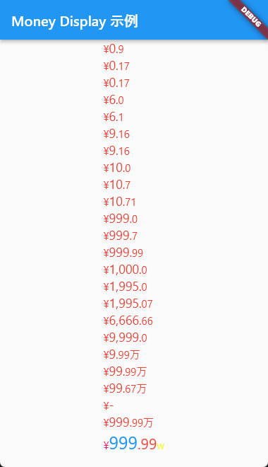

# Money Display

A Flutter widget for displaying Chinese currency format with flexible customization.

## Author

- Author: Juncai Li
- Email: [291148484@163.com](291148484@163.com)
- License: [MIT](http://thispage.tech:9680/jclee1995/flutter_money_display/-/blob/master/LICENSE)
- Repository: [http://thispage.tech:9680/jclee1995/flutter_money_display.git](http://thispage.tech:9680/jclee1995/flutter_money_display.git)

## Workflow Logic

This module provides a `ChineseMoneyDisplayWidget` component designed to display currency amounts in Chinese currency format, such as "¥123,456.78," and offers various customization options to meet different requirements.

The approximate logic for displaying currency in this module is as follows:

1. **Constructor Parameters**: The `ChineseMoneyDisplayWidget` constructor takes multiple parameters, including the currency amount (`price`) and various options for custom display, such as integer part font size, decimal part font size, maximum number, overflow symbol, and more.

2. **Formatting the Price**: The `_formatPrice` method is responsible for formatting the incoming `price` into rich text (`TextSpan`). First, it converts the price into a string and uses regular expressions to separate the integer and decimal parts.

3. **Handling Large Values**: If the price is greater than or equal to `maxNum`, it displays the `overflowSymbol`, typically a symbol representing infinity. If the price is less than `maxNum`, the processing continues.

4. **Handling Prices Greater Than Ten Thousand**: If the price is greater than ten thousand, the integer part is divided into an integer part and a decimal part (if any). If there is no decimal part, the "万" symbol is directly added. If there is a decimal part, both the integer and decimal parts are displayed together, with the integer part followed by the "万" symbol.

5. **Handling Prices Greater Than a Thousand**: If the price is greater than a thousand, the integer part is formatted, and a comma separator is added between thousands. The processing is similar to the above, depending on whether there is a decimal part, it displays the integer part, decimal part, and the "万" symbol.

6. **Handling Prices Less Than a Thousand**: For prices less than a thousand, the integer part does not have a comma separator. Instead, it displays the integer part, decimal part (if any), and the "万" symbol based on whether there is a decimal part.

7. **Handling Decimal Places**: If the price has a decimal part, it is displayed, and the style is set according to `smallFontsize` and `decimalDigitColor`.

8. **Text Integration**: All these text segments are integrated into a `TextSpan` for displaying together.

9. **Building Rich Text**: In the `build` method, a part of the rich text is the `currencySymbol`, which appears in front of the currency symbol. Then, the rich text part returned by `_formatPrice` is displayed in the `RichText` component. The entire component is responsible for displaying this rich text on the screen.

Through this logic, the `ChineseMoneyDisplayWidget` component can display the input price in Chinese currency format and customize the style based on the provided parameters. This allows developers to easily integrate it into Flutter applications to meet various currency display requirements.

## Usage

Describe the simplest usage in one sentence:

```dart
ChineseMoneyDisplayWidget(99.89)
```

To use the `MoneyDisplay` widget, simply import it and include it in your Flutter app. Here's a simple example:

```dart
import 'package:flutter/material.dart';
import 'package:money_display/money_display.dart';

void main() {
  runApp(const MoneyDisplayExample());
}

class MoneyDisplayExample extends StatelessWidget {
  const MoneyDisplayExample({super.key});

  @override
  Widget build(BuildContext context) {
    return MaterialApp(
      home: Scaffold(
        appBar: AppBar(
          title: const Text('Money Display 示例'),
        ),
        body: const Center(
          child: Column(
            crossAxisAlignment: CrossAxisAlignment.start,
            children: [
              ChineseMoneyDisplayWidget(0.9),
              ChineseMoneyDisplayWidget(0.17),
              ChineseMoneyDisplayWidget(0.1796),
              ChineseMoneyDisplayWidget(6),
              ChineseMoneyDisplayWidget(6.1),
              ChineseMoneyDisplayWidget(9.16),
              ChineseMoneyDisplayWidget(9.1671),
              ChineseMoneyDisplayWidget(10),
              ChineseMoneyDisplayWidget(10.7),
              ChineseMoneyDisplayWidget(10.71),
              ChineseMoneyDisplayWidget(999),
              ChineseMoneyDisplayWidget(999.7),
              ChineseMoneyDisplayWidget(999.99),
              ChineseMoneyDisplayWidget(1000),
              ChineseMoneyDisplayWidget(1995.0),
              ChineseMoneyDisplayWidget(1995.07),
              ChineseMoneyDisplayWidget(6666.66),
              ChineseMoneyDisplayWidget(9999),
              ChineseMoneyDisplayWidget(99999),
              ChineseMoneyDisplayWidget(999999),
              ChineseMoneyDisplayWidget(996786),
              ChineseMoneyDisplayWidget(9999999), // maxNum 默认值为10000
              ChineseMoneyDisplayWidget(
                9999999,
                maxNum: 10000001,
              ),
              ChineseMoneyDisplayWidget(
                9999999.97,
                maxNum: 10000001,
                integerColor: Colors.blue,
                integerFontsize: 25,
                decimalFontsize: 21,
                currencySymbolColor: Colors.pink,
                tenThousandSymbol: 'w',
                tenThousandSymbolColor: Colors.limeAccent,
              ),
            ],
          ),
        ),
      ),
    );
  }
}
```



## ChineseMoneyDisplayWidget Parameter Description

In this example, we import the `ChineseMoneyDisplayWidget` and use it to customize the style and symbol for displaying prices.

### price

- **Type**: `double`
- **Default Value**: None
- **Description**: The price, the currency amount to be displayed in the widget.

### integerFontsize

- **Type**: `double`
- **Default Value**: `18`
- **Description**: Font size for the integer part.

### decimalFontsize

- **Type**: `double`
- **Default Value**: `15`
- **Description**: Font size for the decimal part.

### currencySymbolFontsize

- **Type**: `double`
- **Default Value**: `15`
- **Description**: Font size for the currency symbol.

### tenThousandSymbolSize

- **Type**: `double`
- **Default Value**: `15`
- **Description**: Font size for the ten-thousand separator ("万").

### maxNum

- **Type**: `double`
- **Default Value**: `1000000`
- **Description**: The maximum allowed number; if the number exceeds this value, the `overflowSymbol` will be displayed.

### overflowSymbol

- **Type**: `String`
- **Default Value**: `'-'`
- **Description**: The symbol to be displayed when the number exceeds the maximum value.

### tenThousandSymbol

- **Type**: `String`
- **Default Value**: `'万'`
- **Description**: The text used to separate ten-thousand units.

### currencySymbol

- **Type**: `String`
- **Default Value**: `'¥'`
- **Description**: The currency symbol, defaulting to the Chinese Renminbi symbol "¥."

### tenThousandSymbolColor

- **Type**: `Color`
- **Default Value**: Red
- **Description**: The color of the ten-thousand separator.

### integerColor

- **Type**: `Color`
- **Default Value**: Red
- **Description**: The text color for the integer part.

### decimalDigitColor

- **Type**: `Color`
- **Default Value**: Red
- **Description**: The text color for the decimal part.

### currencySymbolColor

- **Type**: `Color`
- **Default Value**: Red
- **Description**: The color of the currency symbol.

### overflowSymbolColor

- **Type**: `Color`
- **Default Value**: Red
- **Description**: The symbol color when the number exceeds the maximum value.

### integerFontWeight

- **Type**: `FontWeight`
- **Default Value**: `FontWeight.normal`
- **Description**: The font weight for the integer part.

### decimalFontWeight

- **Type**: `FontWeight`
- **Default Value**: `FontWeight.normal`
- **Description**: The font weight for the decimal part.

### tenThousandSymbolWeight

- **Type**: `FontWeight`
- **Default Value**: `FontWeight.normal`
- **Description**: The font weight for the ten-thousand separator ("万").

### currencyFontWeight

- **Type**: `FontWeight`
- **Default Value**: `FontWeight.normal`
- **Description**: The font weight for the currency symbol.

These parameters allow you to customize the appearance and behavior of the ChineseMoneyDisplayWidget to suit the needs of your application. You can control font size, color, symbols, and define the symbol to be displayed when the number exceeds the maximum value by adjusting these parameters.